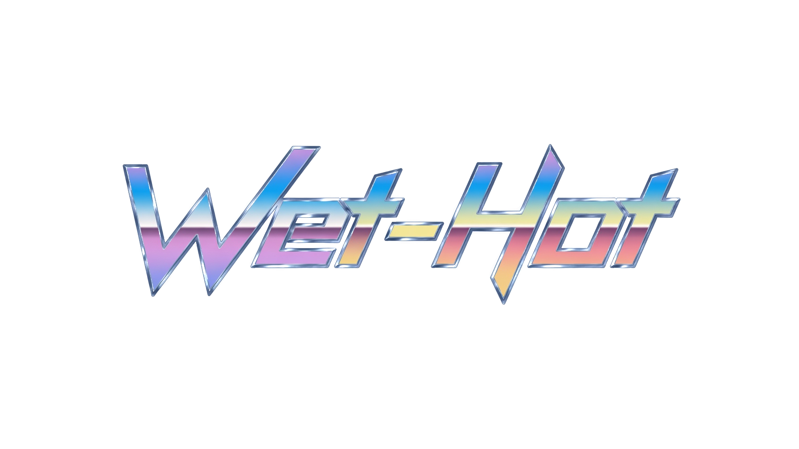

  

A fan-made Pokémon game set in a region based mostly on South Florida. Built to run entirely in the browser, and open for anyone to fork, study, and modify.

> **Status:** Early development (pre-alpha). Systems are being built from the ground up.

---

## Licensing

- **Source code:** [GNU GPLv3](LICENSE) unless otherwise noted. Forks and modifications are welcome and must remain open under the same license.
- **Original assets** (original art, music, writing, and dex data created for this project): *CC BY-SA 4.0*.

---

## Legal Disclaimer

This is a **non-commercial, fan-made project** created purely out of love for the games. It is **not affiliated with, endorsed by, or associated with** Nintendo, Game Freak, Creatures Inc., or The Pokémon Company. *Pokémon* and all related names and properties are trademarks of their respective owners. This project claims **no ownership** of the Pokémon intellectual property and **seeks no financial gain**.

---

## About

*Pokémon: Wet-Hot* is in some ways an autobiography and a retrospective on my life so far. It pairs the **Gen-4 art style** with **mechanics through Gen 9** (maybe gen 10 depending on release), a regional dex built from real local ecology (and invasive ecology as well). Wet-Hot is more grounded and mature Pokemon game, about eviromentalism and the price of building on paradise.

The whole game runs **client-side in the browser**. No accounts, no server, no tracking. You open a webpage and play.

---

## Contributing & Modding

I want this project to be a base for others to use to make thier own pokemon fan games in this format. Because most game data lives in JSON, you can add Pokémon, moves, maps, and encounters without touching the engine.

- See `SPECIFICATION.md` for the full technical design
- Data schemas live in `/data`; edit or add entries and reload

---

## Development Roadmap

A milestone-based plan. Each milestone produces something runnable; later milestones depend on earlier ones.

---

### M0 - Project Setup & Foundation

- Repository, `LICENSE`, `README`, `CONTRIBUTING`
- Static-site scaffold
  - Game Canvas
  - Dev Log drop down from nav bar

---

### M1 - Overworld Core

- Canvas viewport (16:10 aspect ratio (32x20 tiles sets), integer-scaled)
- Tileset loading + layered tilemap rendering (ground / above / collision), 32x32px tiles
- Player centrend view
- Grid-based movement with smooth tile interpolation
- `requestAnimationFrame` game loop with delta time
- Game clock with selectable speeds (1× / 2× / 3×)
- Dev tools: tile painter, coordinate readout

---

### M2 — Menu & UI Shell
- Pause/main menu framework
- Placeholder screens: Bag, Party, PC Boxes, Player Card, Pokédex, Map/Story Tracker

---

### M2 - Menu & UI Shell
- Pause/main menu framework
- Placeholder screens: Bag, Party, PC Boxes, Player Card, Pokédex, Map/Story Tracker

---

### M3 - Battle Engine Foundation 

- Battle engine module (TypeScript)
- `Pokemon` class, species/move/type data loading
- Type-effectiveness chart
- Wild-encounter generation: base stats, IVs/EVs, nature, ability, shiny roll, movepool
- Core battle loop (single battles first)
- Catching mechanics

---

### M4 - Party & Storage Services

- Party management
- PC box services
- Save system; save to local machine, jsons

---

### M5 - Progression Systems

- EXP, leveling, and evolution services (including level, item, trade, and friendship evolutions)
- Movesets & move-learning on level-up
- Held items, status conditions, friendship

---

### M6 - Trainers, Gyms & Economy

- Trainer battles
- Gym battles + 8-badge system
- Healing loop: Pokécenter, Pokémart, healing items

---

### M7 - Content Buildout

- All ~100 base species (≈300 counting evolutions), each with a base sprite
- Full starter lines, gym-leader rosters, regional variants
- Expanded move and item sets
- Heavy battle playtest + balance pass

---

### M8 - Overworld Buildout

- Color palette lock + tileset finalization
- Full region layout: towns, routes, and the in-between (start area → Gym 1 → Gym 2 first)
- Encounter zones + Pokédex-to-area mapping
- Day/night cycle (≈1h dawn / 3h day / 1h dusk / 3h night)
- Travel: running, rentable scooter, Surf, and fast-travel (Fly, Train, Bus, Ride-share)
- Expanded dev map menu

---

### M9 - Story Integration

- League challenge framing and progression gates
- **Team Paradise** arc  the Paradise Island finale (post-Gym 7/8, pre-Elite Four)
- **Elite Four (double battles)** + Champion
- Legendary encounters 

---

### M10 - Polish & 1.0

- Final sprites and regional forms
- Full playtest, balance, and bug pass
- Battle/menu UI finalization
- Save robustness, accessibility, and performance budget review
- Release candidate → 1.0

---

## The Region & Story *(spoiler-light)*

You begin in your hometown, {`Name TBD`}, and travel an open, any-order gym circuit across {`Name TBD`} Region. Behind the region's sunny prosperity is **Team Paradise**. Luxury land developers, fronted by the beloved **Pete**, who privately commit serious crimes against the people and the wild to build their walled "paradise." The trail leads to **Paradise Island** off Key West for the climax, before the Elite Four at the heart of Lake {`Name TBD`}.

Tone target: grounded, character-driven, and mature in *theme* (greed, ecological harm, corruption).

---

